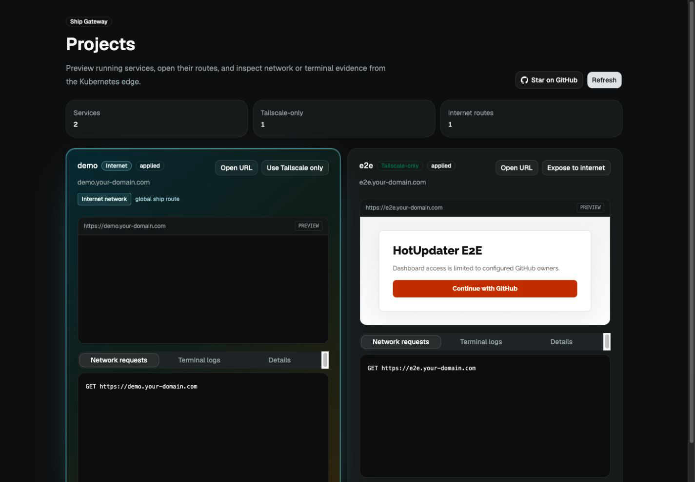
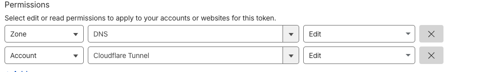

# Ship



Ship turns a local `Dockerfile` or Docker Compose project into a service under
`*.your-domain.com`. It is built for small self-hosted clusters, Mac mini
homelabs, and teams that want a thin deployment path without introducing a full
PaaS.

## Why Use Ship?

Ship is for deploying many apps from a self-hosted Mac mini or similar small
server. Services stay private inside your tailnet by default, and you can expose
them publicly only when you choose to.

The target workflow is deliberately short:

1. Scaffold an SSR app.
2. Run `ship --service demo`.
3. Open `https://demo.your-domain.com`.
4. Confirm the app is live right away.

Ship should make the path from a local project to a private-by-default service
feel direct, with public exposure as a later explicit choice.

## Quick Start

For prerequisites, `.env` values, Windows notes, troubleshooting, and uninstall
steps, see
[docs/guide/installation.md](docs/guide/installation.md).

### For Humans

Before you start, have:

- a domain managed by Cloudflare, such as `your-domain.com`
- a Tailscale account where you can create tags and OAuth credentials

Install the CLI on macOS or Linux:

```sh
curl -fsSL https://raw.githubusercontent.com/gronxb/ship/main/install.sh | sh
export PATH="$HOME/.local/bin:$PATH"
ship -v
```

The installer uses the latest GitHub Release binary by default, so you do not
need to clone this repository to install or upgrade Ship.

Get the credentials, then create `.env` from the `.env.example` shape:

- Cloudflare: create an
  [API token](https://developers.cloudflare.com/fundamentals/api/get-started/create-token/)
  with Zone DNS Edit, Zone Read, and Account Cloudflare Tunnel Edit. Ship uses
  it to create the wildcard DNS record during install, then to publish one
  public hostname at a time through Cloudflare Tunnel when you choose
  **Expose Internet**.

  Token permissions should include at least these rows:

  

- Tailscale: open the Tailscale admin console, go to Access Control → JSON
  Editor, then add or merge these entries into the policy:

```json
{
  "tagOwners": {
    "tag:k8s-operator": [],
    "tag:k8s": ["tag:k8s-operator"]
  }
}
```

  Then create an OAuth client with write access for General/Services,
  Devices/Core, and Keys/Auth Keys on `tag:k8s-operator`.

  Cloudflare Tunnel internet exposure does not require Tailscale Funnel
  `nodeAttrs`. If your tailnet policy already has `nodeAttrs` for another
  service, keep it; Ship only needs the `tagOwners` block above for the default
  Tailscale Gateway path.

```env
SHIP_DOMAIN=your-domain.com
CLOUDFLARE_API_TOKEN=your-cloudflare-token
TAILSCALE_CLIENT_ID=your-tailscale-client-id
TAILSCALE_CLIENT_SECRET=your-tailscale-client-secret

# Optional. ship install can usually infer these from the token and domain.
# CLOUDFLARE_ACCOUNT_ID=your-cloudflare-account-id
# CLOUDFLARE_ZONE_ID=your-cloudflare-zone-id

# Optional dashboard service name. The dashboard always stays Tailscale-only.
# Defaults to k8s, which gives you k8s.your-domain.com.
# SHIP_DASHBOARD_SERVICE=ops
```

Then run:

```sh
ship install
ship upgrade
```

### For Agents

Paste this prompt into Codex, Claude Code, Cursor, or another coding agent from
the project you want to run Ship from:

```text
Install and verify Ship for this project.

Read https://raw.githubusercontent.com/gronxb/ship/main/docs/guide/installation.md
and follow it end to end. Do not summarize the guide back to me; use it as the
runbook.

Work from the project root and do the following:

1. Install the Ship CLI if `ship -v` is not already available:
   `curl -fsSL https://raw.githubusercontent.com/gronxb/ship/main/install.sh | sh`
   then add `$HOME/.local/bin` to PATH for this session.
2. Ensure `.env` exists. If it does not, create it from the Ship `.env.example`
   shape.
3. Inspect `.env`. If any required value is missing, empty, or still a
   placeholder, ask me only for the missing values:
   - `SHIP_DOMAIN`
   - `CLOUDFLARE_API_TOKEN`
   - `TAILSCALE_CLIENT_ID`
   - `TAILSCALE_CLIENT_SECRET`
4. If I provide optional values, also preserve them:
   - `CLOUDFLARE_ACCOUNT_ID`
   - `CLOUDFLARE_ZONE_ID`
   - `SHIP_ACME_EMAIL`
   - `SHIP_DASHBOARD_SERVICE`
5. Never print secrets. Write the completed values to `.env`.
6. Once `.env` is complete, load it for this shell and continue automatically:
   `set -a`
   `. ./.env`
   `set +a`
   `ship install`
   `ship upgrade`
7. Verify the dashboard rollout:
   `kubectl rollout status deployment/${SHIP_DASHBOARD_SERVICE:-k8s} \
   -n ship-services --timeout=180s`
8. Verify the user-facing dashboard:
   `curl -I https://${SHIP_DASHBOARD_SERVICE:-k8s}.$SHIP_DOMAIN`
9. Finish with the dashboard URL, Kubernetes context, and any command that
   failed with its relevant output.
```

Ship can deploy any project with either a `Dockerfile` or Docker Compose. The
framework and runtime are up to you. This example uses a Hono hello-world app on Bun. Hono is a small
web framework for the Web Platform, and its
[Bun guide](https://hono.dev/docs/getting-started/bun) starts from the same tiny
app shape.

```sh
bun create hono@latest demo
cd demo
bun install
```

Use the Bun template, then make sure `src/index.ts` returns a simple response:

```ts
import { Hono } from 'hono'

const app = new Hono()

app.get('/', (c) => c.text('Hello Ship!'))

export default app
```

Add a minimal `Dockerfile`:

```Dockerfile
FROM oven/bun:1

WORKDIR /app
COPY package.json bun.lock ./
RUN bun install --frozen-lockfile --production
COPY . .

EXPOSE 3000
CMD ["bun", "run", "src/index.ts"]
```

Deploy it:

```sh
ship --service demo
```

Open `https://demo.your-domain.com` to see `Hello Ship!`. For your own app, keep
the same pattern: add a `Dockerfile`, then run `ship --service <name>`.

Bring the service down when it is no longer needed:

```sh
ship down --service demo
```

`ship down` removes the Deployment, Service, HTTPRoute, generated env Secret,
legacy Ingress, and Compose EndpointSlice. For the default local kind workflow,
it also removes the deployed image from every kind node and from local Docker.
Use `--dry-run` to preview the cleanup. Images pushed with `REGISTRY` and images
owned by a Compose project stay in their remote registry or Compose project.

For a multi-container Compose project, Ship auto-detects `compose.yaml`,
`compose.yml`, `docker-compose.yaml`, or `docker-compose.yml` when no Dockerfile
exists. A service named `gateway` is selected automatically; otherwise use an
explicit service that publishes a TCP port:

```sh
ship --service demo --compose-file ./docker-compose.yml --compose-service gateway --env-file ./.env
```

Compose stays on the host. Ship runs `docker compose up --wait` and connects the
selected published port to the cluster with a selectorless Service and managed
EndpointSlice. Compose files are trusted executable input. Ship never copies a
Compose env file into a Kubernetes Secret, never overrides the Compose project
name, and never removes Compose volumes. This host bridge currently requires a
local kind cluster.

## Agent Skill

Install the Ship skill once:

```sh
npx skills add gronxb/ship
```

Then open a project in Claude Code, Codex, or another agent that can use the
skill:

```text
$ship deploy this project as demo
```

That is enough. The skill uses an existing Compose project when present or can
create a suitable `Dockerfile`, deploy with Ship, and give you
`https://demo.your-domain.com`.

## Exposure Model

Ship is private by default:

- `*.your-domain.com` resolves to the Tailscale Gateway address as a
  DNS-only Cloudflare record.
- only devices in your tailnet can reach deployed services.
- Dockerfile projects do not need host port mapping.
- Compose projects must publish the selected service port on a non-loopback host address.

`ship install` also creates a Cloudflare Tunnel connector in the cluster. It
does not make every service public. Internet exposure is a promotion path for a
service that already exists on the Tailscale route; a first deploy directly to
the internet is rejected. When you expose one service publicly, Ship keeps the
same hostname and adds a more specific proxied Cloudflare CNAME for that
service:

- private default: `demo.your-domain.com` → wildcard DNS-only record →
  Tailscale Gateway
- public after **Expose Internet**: `demo.your-domain.com` → proxied CNAME →
  Cloudflare Tunnel → in-cluster service
- private again: Ship removes the specific CNAME and tunnel route, so the
  wildcard Tailscale route works again

The Ship dashboard itself is never eligible for internet exposure. That rule is
based on the configured dashboard service/host, not on the literal service name
`k8s`: if you set `SHIP_DASHBOARD_SERVICE=ops`, `ops.your-domain.com` remains
Tailscale-only too.

To expose one non-dashboard service publicly from the CLI, deploy it on
Tailscale first, then promote the existing service:

```sh
ship --service demo
ship --service demo --exposure internet
```

Later redeploys keep the current network exposure unless you pass `--exposure`
explicitly. An internet-exposed service stays on the internet path; a
Tailscale-only service stays Tailscale-only.

## Development

Run tests:

```sh
make test
```

Main directories: `cmd/ship`, `internal/deploy`, `deploy-system`, `start-app`,
and `scripts`.

## Security

Ship shells out to Docker, kubectl, kind, and registry tooling from the machine
where it runs. Treat that host as part of your deployment trust boundary. Review
generated manifests with `ship --dry-run --json` before applying changes to a
new cluster.

Report vulnerabilities using the process in [SECURITY.md](SECURITY.md).

## Contributing

Issues and pull requests are welcome. Start with
[CONTRIBUTING.md](CONTRIBUTING.md) and run `make test` before submitting a PR.

## License

MIT. See [LICENSE](LICENSE).
